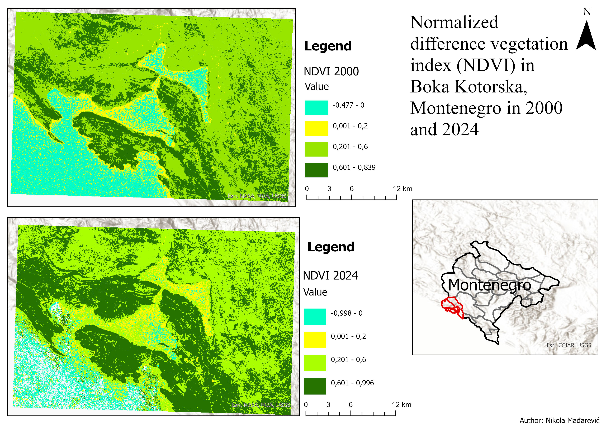
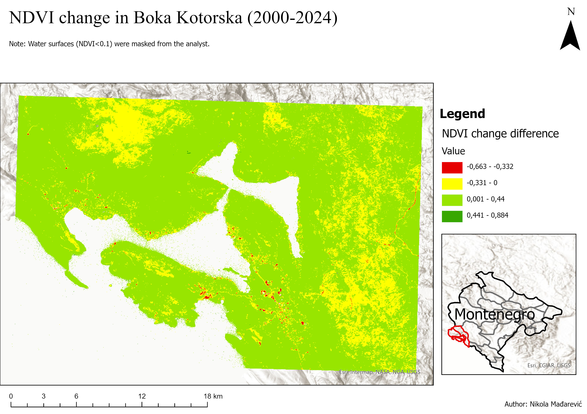
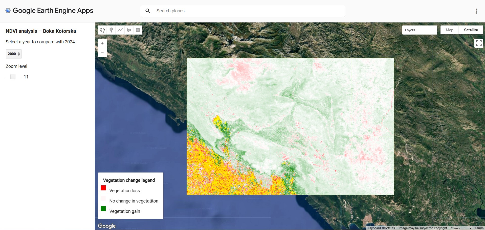

# NDVI Change Analysis – Boka Kotorska (2000–2024)

This repository contains a **Google Earth Engine (GEE)** script designed to analyze spatial patterns of vegetation change between 2000 and 2024 in the Boka Kotorska region, Montenegro.

The project processes Landsat NDVI composites to evaluate environmental dynamics, exports raster outputs for further spatial analysis in **ArcGIS Pro**, and builds an interactive Earth Engine user interface (UI) for dynamic multi-year comparison.

---

## 📌 Features

- **Automated NDVI Processing:** Generates annual mean NDVI composites using Landsat 32-day NDVI datasets.
- **Vegetation Difference Calculation:** Computes pixel-based NDVI change between 2000 and 2024.
- **Interactive GEE Application:** Features a custom UI panel with a dynamic dropdown to compare any year (2000–2024) against 2024, along with custom zoom controls.
- **Automated Export Pipelines:**
  - Exports rasters directly to **Google Drive** projected in `EPSG:32634` (UTM Zone 34N).
  - Saves processing results directly to **GEE Assets** for fast loading.

---

## 🗺️ Study Area & Dataset

- **Area of Interest (AOI):** Boka Kotorska, Montenegro `[18.45, 42.33, 18.90, 42.55]`
- **Dataset:** Landsat Collection 2 Tier 1 Level 2 32-Day NDVI Composites (`LANDSAT/COMPOSITES/C02/T1_L2_32DAY_NDVI`)
- **Spatial Resolution:** 30 meters

---

## 🛠️ Tools & Technologies

- **Google Earth Engine (GEE):** Cloud processing and custom UI design (JavaScript API)
- **ArcGIS Pro:** Post-processing and cartographic visual layout
- **Landsat Collection 2:** Satellite imagery source

---

## 🚀 How to Run the Script

1. Open the [Google Earth Engine Code Editor](https://code.earthengine.google.com/).
2. Create a new script and paste the contents of `geeNDVI_code.js`.
3. Click **Run**.
4. Use the UI panel on the left to select different historical years (2000–2024) and interactively explore NDVI changes across Boka Kotorska.

---

## 📂 Exported Outputs

The script prepares three main spatial datasets for GIS workflows:
1. `NDVI_Boka_2000` (Mean NDVI layer for the year 2000)
2. `NDVI_Boka_2024` (Mean NDVI layer for the year 2024)
3. `NDVI_Boka_Razlika_2000_2024` (Vegetation difference raster)

## 📊 Results

The analysis provides annual mean NDVI composites and a pixel-based
comparison of vegetation conditions between 2000 and 2024.

The resulting NDVI difference layer highlights areas of vegetation
increase and decrease across the study area.

The exported rasters were further used for cartographic visualization
and analysis in ArcGIS Pro.

### NDVI 2000 and 2024

### NDVI Change

### GEE Application

---

## 👤 Author

* **Nikola Mađarević**
